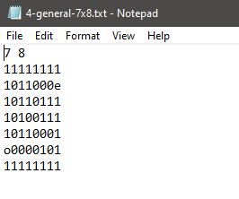
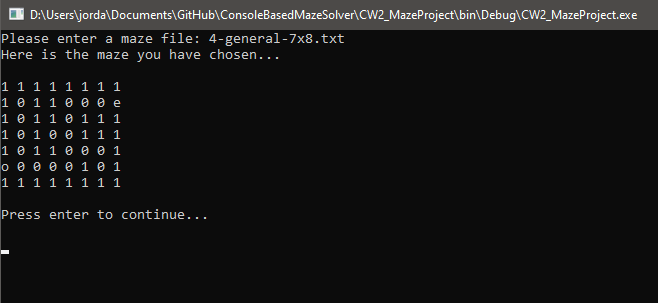
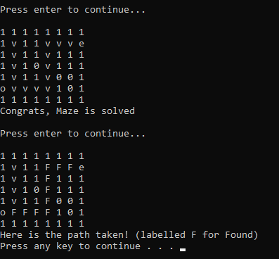

# ConsoleBasedMazeSolver
A Console Based Maze Solver that takes text files as input and solves them - C#

This project utilises C#'s File IO along with Using Stacks and LinkedList / Tree Traversal algorithm methods.

Simply load one of the pre-made text files and hit enter to watch the program take a step by step through of the maze, the program will even work out the best and most efficient path to take which will be labled as F.

## Sample Screenshots

